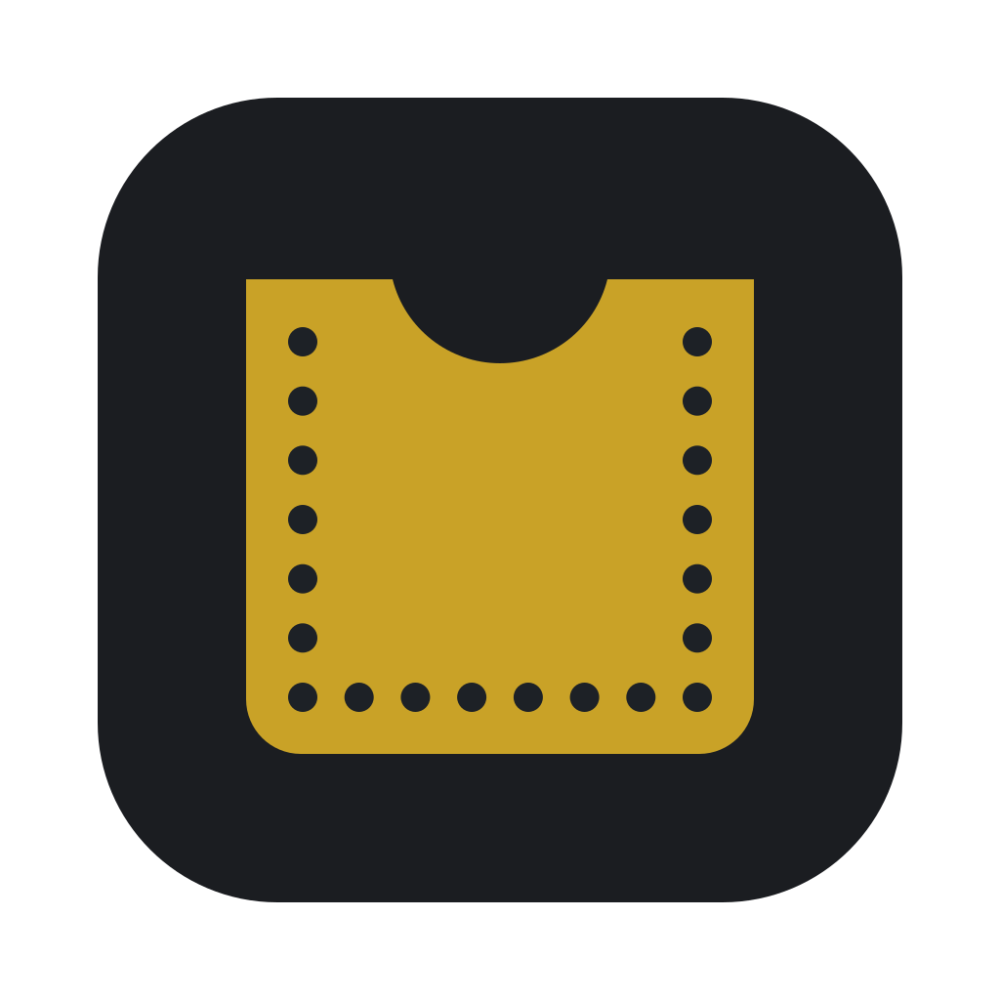
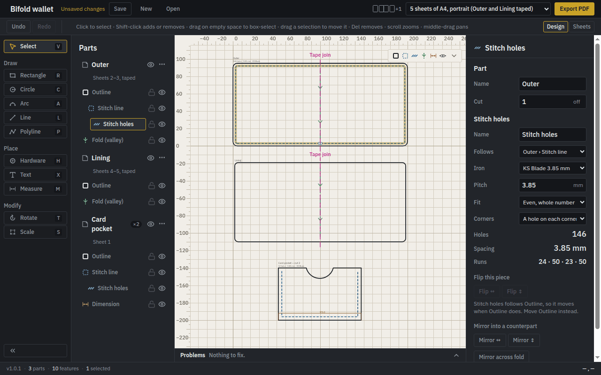
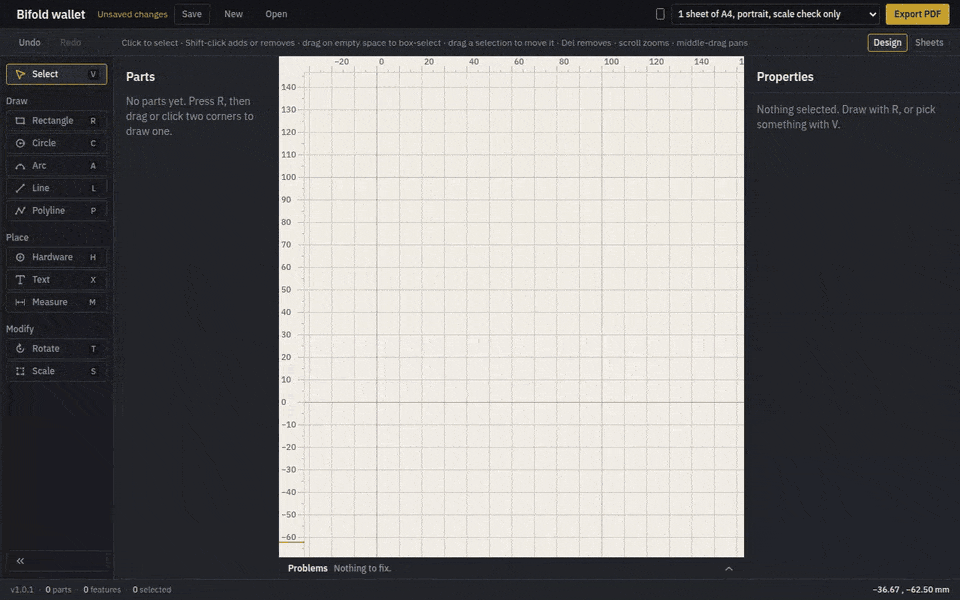
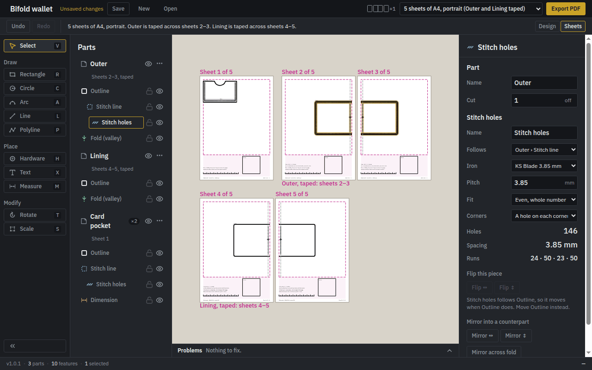
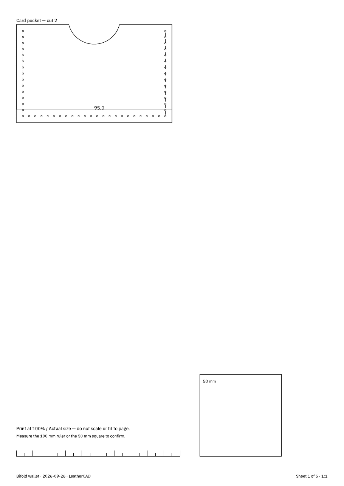

# LeatherCAD

**Leathercraft patterns that print at exactly 1:1.** 
Draw in real millimetres, stitch along the edge, and print a template you can cut out.

**[Download](https://github.com/crnlsp/leathercad/releases/latest)** ·
**[Getting started](docs/getting-started.md)** ·
**[What's new](CHANGELOG.md)** ·
**[Roadmap](docs/roadmap.md)**

 

## Why LeatherCAD

A general drawing program sees lines. LeatherCAD sees **leather**: an outline you cut, a stitch line
that follows it, holes at your pricking iron's pitch, a fold, a pocket you cut twice. Change the
outline and everything that depends on it follows. Then it prints on ordinary paper, **true to the
millimetre** — and every sheet carries a 50 mm square so you can check that with a steel rule.

## A bifold wallet, start to finish

1. **Draw roughly, then type it exactly.** Drag out a rectangle, then give it 200 × 95 mm and 5 mm
   corners. Every number is in millimetres, and what you type is what prints.
2. **Stitch it.** *Add stitch line* follows the edge 3 mm in; *Add holes* places them at your iron's
   pitch and shows how many there are and the spacing they came out at.
3. **Fold it.** A fold line shows which way it folds.
4. **Add the rest.** A lining, and a card pocket with a thumb scoop, stitched on three sides and
   marked *cut 2*.
5. **See the paper before you print.** The Sheets view shows every piece exactly where the PDF will
   put it.

This demo is recorded from the real app by a script
([`e2e/media/readme.spec.ts`](e2e/media/readme.spec.ts)), so it always shows what LeatherCAD
actually does.

## What it does

<table>
<tr>
<td width="50%" valign="top">

### Parts that know what they are

Rectangles, circles, arcs, lines and polylines with arc segments — a pocket with a thumb scoop is one
outline. Cut-outs, folds, marking lines, hardware holes, text and dimensions belong to the part they
are drawn on.

### Stitching that follows the edge

A stitch line is an inset of its outline, and holes are placed along it at the iron's pitch, with a
hole on every corner. Change a panel from 105 to 110 mm and its stitching updates itself. A seam
allowance can grow outward from the stitching instead.

### Problems stated, not hidden

Holes too close to the edge, spacing far from the iron's pitch, a stitch line that lost its outline:
each one is listed, and selecting it shows you where.

</td>
<td width="50%" valign="top">

### See the paper first

The paper list says what each choice prints — *3 sheets of A4, portrait*, *1 sheet of A4,
landscape* — and Parts says which sheet each part is on. A part bigger than the paper is tiled across
sheets with join lines and registration crosses, never scaled to fit.

### Print, and check the print

Export writes a vector PDF on A5, A4, A3, Letter or Legal. Every sheet has a 50 mm square and a
100 mm ruler: if they measure true, so does everything on the sheet.

### Your work is kept

Closing with unsaved changes asks first, and after a crash LeatherCAD offers your unsaved work back.

</td>
</tr>
</table>

<table>
<tr>
<td width="62%" align="center">

 <b>The Sheets view</b> — the pieces on the paper, exactly as the PDF places them.
</td>
<td width="38%" align="center">

 <b>The printed sheet</b> — with the square and ruler to check it by.
</td>
</tr>
</table>

## Download

| System | File | Then |
|---|---|---|
| **Linux** | `LeatherCAD-…-x86_64.AppImage` | `chmod +x` it and run it. It installs nothing. |
| **Windows** | `LeatherCAD-…-x64.exe` | Run it. It installs for your user only, no administrator needed. |
| **macOS** | `LeatherCAD-…-universal.dmg` | Drag LeatherCAD to Applications. Apple silicon and Intel. |

All three are on the **[latest release](https://github.com/crnlsp/leathercad/releases/latest)**.
LeatherCAD is free and open source, and its installers are **not code-signed** — signing costs
money every year — so Windows and macOS warn the first time you open it.
[Getting started](docs/getting-started.md) shows how to open it anyway, and how to check that a
download is the one this repository built.

## The 1:1 promise

A line drawn as 100 mm measures 100 mm on paper. Everything in LeatherCAD's design serves that:

- **Millimetres all the way down.** The model has no pixels; the screen is the only place that
  knows about them.
- **Never scaled to fit.** A part too big for the sheet gets more sheets, not a smaller drawing.
- **Measured on every change.** CI exports a print test and measures the PDF, rendered by an
  independent renderer, on Linux, Windows and macOS
  ([`e2e/print-verification.spec.ts`](e2e/print-verification.spec.ts)).
- **Measured on paper.** Before a release, a person prints it and measures it with a steel rule
  ([`docs/print-verification-log.md`](docs/print-verification-log.md)).

## Documentation

**For makers:** [Getting started](docs/getting-started.md) — install, draw, stitch, print, and check
the print. [Glossary](docs/glossary.md) — the leathercraft words the app uses.

**For contributors:** start with [CONTRIBUTING.md](CONTRIBUTING.md), then

| Document | What it covers |
|---|---|
| [architecture.md](docs/architecture.md) | The stack, the layers and the rules between them |
| [domain-model.md](docs/domain-model.md) | Parts, features, derivation, stitching, validation |
| [geometry.md](docs/geometry.md) | Representation, numerics, offsetting |
| [file-format.md](docs/file-format.md) | The `.lcp` format, versions and migrations |
| [printing.md](docs/printing.md) | Export, pagination, tiling, the accuracy budget |
| [testing.md](docs/testing.md) | Test layers, property tests, CI |
| [roadmap.md](docs/roadmap.md) | What is next, and what is known but not fixed |
| [adr/](docs/adr/) | Why each decision was made |

[`CLAUDE.md`](CLAUDE.md) holds the invariants no change may break. Found a security problem?
Report it privately — see [`SECURITY.md`](SECURITY.md).

## Licence

[Apache-2.0](LICENSE). The interface and every printed word use IBM Plex Sans, under the
[SIL Open Font Licence](assets/fonts/OFL.txt). *Help → Third-Party Notices* lists everything else the
app ships.
